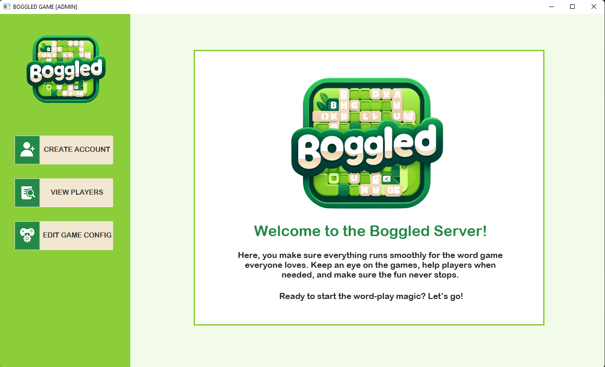
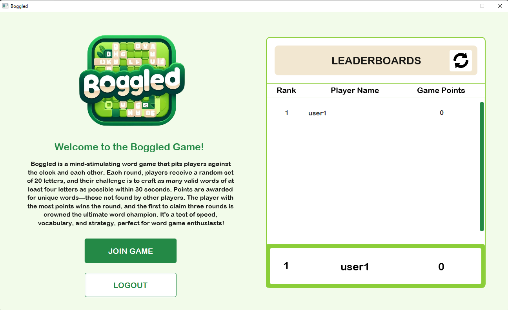
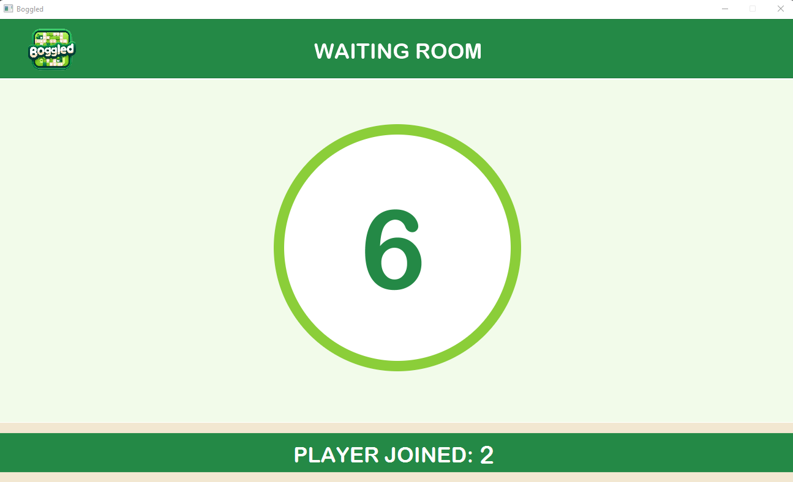
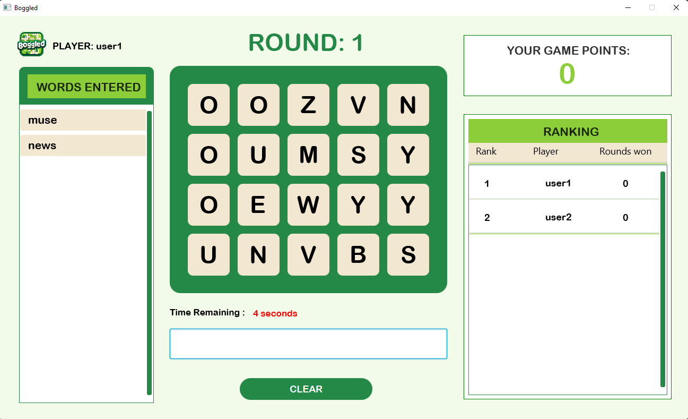

# FINALS PROJECT ON COMPUTER PROGRAMMING 3

---
## Project Set Up Guide 
This document will help you set up and use our special computer program designed for a word game called "Boggled."
A client-server application program that is built in Java programming language and integrating CORBA in its architecture.

---
## Procedures:
### I. Clone the Project
   Clone the project.
### II. Downloading the JDK
1. Visit the website https://www.openlogic.com/openjdk-downloads and select the java version 8 on
the dropdown menu. Other specifications will be dependent on your machine.
2. Download zip file of the version `“8u402-bo6”`.
3. After downloading, extract the zip file on any directories you want but preferably on ‘C:\Program
   Files\...’. Make sure to remember the path of where you extracted the zip file.

### III. Setting up the Environment
1. On the windows search bar, search “environment variables” and select the “Edit the system
   environment variables”.
2. Locate and click “Environment Variables...” in the pop up.
3. Under system variables, either add or replace the variable **JAVA_HOME** using the “edit” or
   “new” button. Make sure to input correct values. Click OK.  
     - `Variable name: JAVA_HOME  `
     - `Variable value: path to your JDK where you extracted the zip file (e.g., C:\Program
   Files\Java\jdk-8)`
4. Again, Under System Variables find the Path variable and click Edit. Add the following to the
   path if not yet included: `%JAVA_HOME%\bin`
5. Move up the `%JAVA_HOME%\bin` to top using ‘Move Up’ Button. Click OK to close all dialogs.

### IIV. Setting the game Database
1. Download the sql file found in this drive:
   https://drive.google.com/drive/folders/1u4DKBg4vcVM4CUvIFYxvH98uxqQTSxNy
2. Assuming that you have a MySQL workbench installed in your machine, open a database
      connection (or create one if necessary) and enter your credentials. Make sure to remember your
      credentials as it will be used in the program specifically in `ServerJDBC` class. 
3. Right-click on the open area on the right and click create schema. Create a schema called
      ‘boggleddb’ and click ‘Apply’, then ‘Apply’ and ‘Finished’.
4. On the heading tab, choose the Server and Data Import.
5. Click the ‘Import from self-contained file’, locate and input the sql file that you downloaded
   earlier, then choose the database ‘boggleddb’ then click ‘Start Import’.
6. After that, it will show ‘Import Complete’, and you may check the database using a query.

### V. Running the Server Program
1. Locate and open the project file you just cloned using IntelliJ Idea.
2. **Optional:** If you want to play the game with LAN, locate the .config file in the project directory:
   src/main/java/.config and change the host variable to the ip address of the server. (Use cmd and
   issue the command ‘ipconfig’ to get the IP address of the server.)
3. **Optional:** Turn off the windows defender firewall if planning to play on LAN and disable any
   other virtual machine like virtual box.
4. If planning to play locally, leave the localhost as it is.
5. The `ServerJDBC` class manages the connection between the server and the database. Assuming
      that you have a username and a password in MySQL, use this to change the credentials of the
      `ServerJDBC` class. It is found in this project’s directory:
      `src/main/java/Server_Java/model/ServerJDBC.java`
6. On code lines 11,12 and 13, change the credentials you have in your MySQL account.
7. Start the ORB daemon using cmd or the terminal of the IntelliJ Idea. Issue the command:
    `start orbd -ORBInitialPort 2000 -ORBInitialHost <host from .config file>`
8. In the project directory: `src/main/java/Server_Java/`, locate the class ServerJava class and either
   compile(build) or run the class.
9. Once the server is ready, it will show the User Interface of the server.

### VI. Running the Server Program
1. If the client is on a different computer, Locate and open the project file they cloned using IntelliJ Idea.
2. **Optional:** If the client is on a different computer, turn off the windows defender firewall and
   disable any other virtual machine like virtual box.
3. **Optional:** If you want to play the game with the server on a different computer, locate the .config
  file in the project directory: src/main/java/.config and change the host variable to the ip address of
  the server. If planning to play locally, leave the localhost as it is.
4. Make sure that the server is running first. 
5. In the project directory: `src/main/java/Client_Java/`, locate the class `ClientJava` class and either
   compile(build) or run the class. 
6. Once the connection is successful, the User Interface for the client will show. 
7. You are now ready to interact with the game.

---
## SAMPLE PROJECT SCREENSHOT:
### Server:
   

---
### Client:

---
### Waiting Room:

---
### In-game:

---
## Project Developers:
1. BARCELLANO, Cristian Dave M.  
2. COLOMA, Stephen M.
3. GUZNMAN, Sanchie Earl M.
4. LEUNG, Leonhard T.
5. NONATO, Marius Glenn M.
6. RAGUDOS, Hannah T.
7. RAMOS, Jerwin Kyle R.
---

